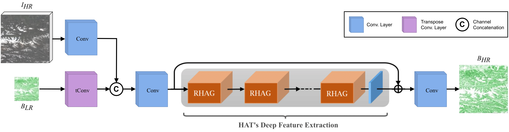
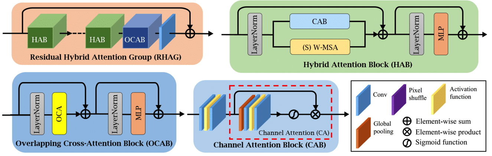

# BioSHARP: Biomass Super-resolution for High AccuRacy Prediction

## Table of Contents
- [Introduction](#introduction)
- [Model Architecture](#model-architecture)
- [Installation](#installation)
- [Datasets](#datasets)


## Introduction
The urgency of climate change emphasizes the need for precise global ecosystem monitoring, with accurate above-ground biomass (AGB) estimation playing a key role in understanding carbon dynamics. Recent advancements in satellite technology, such as ESA's Biomass Satellite and NASA's NISAR mission (set for 2024 launches), reflect global recognition of the importance of non-invasive, regular biomass assessments. These missions aim to offer critical global data on biomass, especially in remote areas, helping inform climate policies.

However, while global satellites provide broad environmental assessments, they lack the fine detail needed for local interventions. BioSHARP addresses this gap by leveraging Deep Learning to enhance low-resolution biomass data, integrating it with high-resolution multispectral Sentinel-2 data. This approach generates 25-meter resolution AGB maps from 100-meter data, offering valuable insights for both global and local assessments. By refining biomass data, BioSHARP supports more accurate, actionable strategies for mitigating climate change globally.


| **Model**                    | **opt** | **bio** | **Params (↓)** | **PSNR (↑)**        | **SSIM (↑)**       | **MSE (↓)**          | **RMSE (↓)**       | **MAE (↓)**        |
|------------------------------|---------|---------|----------------|---------------------|--------------------|----------------------|--------------------|--------------------|
| Bicubic                      |         | ✓       | -              | 17.25               | 0.36               | 1520.01              | 37.01              | 25.66              |
| [ReUse](https://github.com/priamus-lab/ReUse) | ✓       |         | 4.9 M          | 21.86 (0.28)        | 0.54 (0.01)        | 524.24 (30.66)      | 21.80 (0.66)       | 14.63 (0.48)       |
| [HAT-S](https://github.com/XPixelGroup/HAT) |         | ✓       | 9.6 M          | 21.91 (0.04)        | 0.50 (0.00)        | 494.33 (3.34)       | 21.36 (0.07)       | 14.13 (0.06)       |
| [SGNet](https://github.com/yanzq95/SGNet) | ✓       | ✓       | 4.2 M          | 24.06 (0.09)        | 0.63 (0.01)        | 314.75 (7.97)       | 16.85 (0.19)       | 10.98 (0.13)       |
| **BioSHARP (ours)**           | ✓       | ✓       | **3.4 M**      | **24.10** (0.05)    | **0.64** (0.00)    | **308.57** (2.63)    | **16.74** (0.08)    | **10.79** (0.07)    |


## Model Architecture
  

HAT's Deep Feature Extractor from [here](https://arxiv.org/abs/2205.04437):
  

## Installation
To set up the environment for BioSHARP, you'll need the following dependencies:

- CUDA: 11.8
- cuDNN: 8.1
- Python: 3.8.18
- Conda: 22.9.0

You can create the environment using the provided `environment.yml` file by running:

```bash
conda env create -f environment.yml
conda activate biosharp
```

## Datasets
- **High-resolution biomass:** [Eurasia](https://doi.org/10.5281/zenodo.7540824) (images `N50E014_agb.tif`, `N50E012_agb.tif`, `N48E014_agb.tif`, and `N48E012_agb.tif` for the samller experiments on the AOI), [Africa](https://doi.org/10.5281/zenodo.4725667), [North America N](https://doi.org/10.5281/zenodo.7550809), [North America S](https://doi.org/10.5281/zenodo.7550246), [South America N](https://zenodo.org/records/7544238), [South America S](https://doi.org/10.5281/zenodo.8334607), [North Asia N](https://doi.org/10.5281/zenodo.7584224), [North Asia S](https://doi.org/10.5281/zenodo.7584753), [South Asia](https://doi.org/10.5281/zenodo.7545054)
- **Low-resolution biomass:** [ESA Biomass Climate Change Initiative (Biomass_cci): Global datasets of forest above-ground biomass](https://catalogue.ceda.ac.uk/uuid/af60720c1e404a9e9d2c145d2b2ead4e) (image `N50E010_ESACCI-BIOMASS-L4-AGB-MERGED-100m-2010-fv4.0.tif` for the samller experiments on the AOI)
- **High-resolution multispectral data:** Product `COPERNICUS/S2_SR_HARMONIZED` from GEE.

For the smaller experiments in the AOI, you can use the following JAVA code to download the Sentinel-2 data from GEE:

```JAVA
var S2 = ee.ImageCollection("COPERNICUS/S2_SR_HARMONIZED");
var RegionEurope = ee.Geometry.Rectangle([12.0, 46.000000000040004, 15.99999999996, 50.0]);

var S2_Filtered = S2.filterBounds(RegionEurope)
  .filterMetadata("CLOUDY_PIXEL_PERCENTAGE", "less_than", 50)
  .filterDate('2017-01-01', '2017-12-31');
print(S2_Filtered.size());

// Apply a mask to filter out cloud and cloud shadow pixels.
function S2_maskClouds(image) {
  var scl = image.select('SCL');
  var cloudMask = scl.neq(8).and(scl.neq(9));
  return image.updateMask(cloudMask);
}

// Apply the cloud mask function to the image collection.
var cloudMaskedCollection = S2_Filtered.map(S2_maskClouds);

// Apply the median to combine the different images into a single one.
var Median_Image = cloudMaskedCollection.median();

// Export the resulting image.
Export.image.toDrive({
  image: Median_Image,
  description: "Europe_Small_Sentinel2",
  region: RegionEurope,
  scale: 25,
  crs: "EPSG:4326",
  maxPixels: 318638868
});
```
