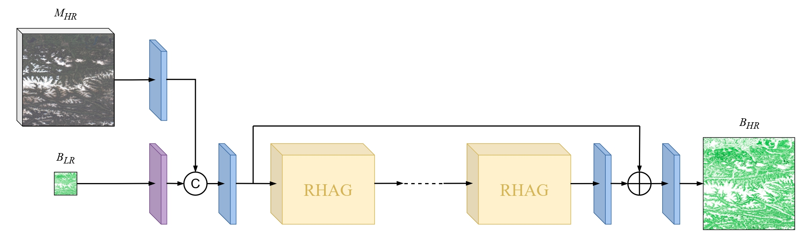

# BiomSHARP: Biomass Super-resolution for High AccuRacy Prediction

## Table of Contents
- [Introduction](#introduction)
- [Results](#results)
  - [Performance Comparison of Models Using Sentinel-2 Bands](#performance-comparison-of-models-using-sentinel-2-bands)
  - [Performance Comparison of Models Using Landsat-5 Bands](#performance-comparison-of-models-using-landsat-5-bands)
- [Model Architecture](#model-architecture)
- [Data Description](#data-description)
  - [Input Data](#input-data)
  - [Ground Truth](#ground-truth)
  - [Data Preparation Steps](#data-preparation-steps)
- [Installation Instructions](#installation-instructions)
- [Usage Examples](#usage-examples)
- [Citations](#citations)

---

## Introduction
Accurate estimation of above-ground biomass (AGB) is essential for understanding carbon stocks and flows that inform climate policies. Existing global satellite missions offer valuable environmental monitoring, but their lower spatial resolution limits their application in detailed local assessments.

This repository contains the official implementation of the paper **"BiomSHARP: Biomass Super-resolution for High Accuracy Prediction"**. BiomSHARP is a deep learning model designed to enhance coarse-resolution biomass data from satellite missions, such as ESA's Biomass and NASA's NISAR satellites, by fusing it with high-resolution multispectral data from sensors like Sentinel-2 or Landsat-5. BiomSHARP achieves an output resolution of 25 meters, a fourfold improvement over the original 100-meter resolution.

By bridging the scale gap between global satellite monitoring and local environmental management, BiomSHARP demonstrates superior performance across multiple metrics and outperforms state-of-the-art methods.

📄 You can find the full paper [here](https://arxiv.org/abs/example).

---

## Results
### Performance Comparison of Models Using Sentinel-2 Bands
| **Model**                                        | **opt** | **bio** | **Params (↓)** | **PSNR (↑)** | **SSIM (↑)** | **MSE (↓)**    | **RMSE (↓)** | **MAE (↓)**  |
|--------------------------------------------------|---------|---------|----------------|--------------|--------------|----------------|--------------|--------------|
| Bicubic                                          |         | ✔       | -              | 17.25        | 0.36         | 7404.83        | 81.68        | 56.65        |
| [HAT-S](https://github.com/XPixelGroup/HAT)      |         | ✔       | 9.6M           | 21.61        | 0.49         | 2531.54        | 48.58        | 32.11        |
| [ReUse](https://github.com/priamus-lab/ReUse)    | ✔       |         | 1.2M           | 23.07        | 0.60         | 1952.91        | 41.82        | 27.09        |
| ReUse*                                           | ✔       |         | 4.9M           | 23.20        | 0.61         | 1895.39        | 41.19        | 26.60        |
| [SGNet](https://github.com/yanzq95/SGNet)        | ✔       | ✔       | 9.2M           | 24.42        | 0.66         | 1400.91        | 35.64        | 22.79        |
| **BiomSHARP (ours)**                              | ✔       | ✔       | **3.4M**       | **24.90**    | **0.70**     | **1254.24**    | **33.70**    | **21.02**    |

### Performance Comparison of Models Using Landsat-5 Bands
| **Model**                                        | **opt** | **bio** | **Params (↓)** | **PSNR (↑)** | **SSIM (↑)** | **MSE (↓)**    | **RMSE (↓)** | **MAE (↓)**  |
|--------------------------------------------------|---------|---------|----------------|--------------|--------------|----------------|--------------|--------------|
| Bicubic                                          |         | ✔       | -              | 17.25        | 0.36         | 7404.83        | 81.68        | 56.65        |
| [HAT-S](https://github.com/XPixelGroup/HAT)      |         | ✔       | 9.6M           | 21.61        | 0.49         | 2531.54        | 48.58        | 32.11        |
| [ReUse](https://github.com/priamus-lab/ReUse)    | ✔       |         | 1.2M           | 23.44        | 0.62         | 1820.05        | 40.24        | 26.27        |
| ReUse*                                           | ✔       |         | 4.9M           | 23.60        | 0.63         | 1755.12        | 39.50        | 25.70        |
| [SGNet](https://github.com/yanzq95/SGNet)        | ✔       | ✔       | 9.2M           | 24.80        | 0.69         | 1280.10        | 34.09        | 21.68        |
| **BiomSHARP (ours)**                              | ✔       | ✔       | **3.4M**       | **25.14**    | **0.71**     | **1194.81**    | **32.84**    | **20.45**    |

---

## Model Architecture
BiomSHARP combines high-resolution multispectral data with low-resolution biomass data through a guided super-resolution approach. The architecture consists of the following components:

  

HAT's RHAG module from [here](https://arxiv.org/abs/2205.04437):


---

## Data Description

### Input Data
- **High-Resolution Multispectral Data:**
  - **Sentinel-2:** 10-20m resolution bands.
  - **Landsat-5:** 30m resolution bands.

- **Low-Resolution Biomass Data:**  
  To train BiomSHARP, we use the [ESA Biomass Climate Change Initiative (Biomass_cci): Global datasets of forest above-ground biomass](https://catalogue.ceda.ac.uk/uuid/af60720c1e404a9e9d2c145d2b2ead4e). In the future, the intention is to leverage biomass data from the following satellite missions after their planned launches in 2025:
  - **ESA's Biomass Satellite**
  - **NASA's NISAR Satellite**

### Ground Truth
We utilize high-resolution biomass data as ground truth for model training and validation. These datasets are sourced from the following repositories:
- **Eurasia:** [DOI](https://doi.org/10.5281/zenodo.7540824)
- **Africa:** [DOI](https://doi.org/10.5281/zenodo.4725667)
- **North America (North):** [DOI](https://doi.org/10.5281/zenodo.7550809)
- **North America (South):** [DOI](https://doi.org/10.5281/zenodo.7550246)
- **South America (North):** [DOI](https://zenodo.org/records/7544238)
- **South America (South):** [DOI](https://doi.org/10.5281/zenodo.8334607)
- **North Asia (North):** [DOI](https://doi.org/10.5281/zenodo.7584224)
- **North Asia (South):** [DOI](https://doi.org/10.5281/zenodo.7584753)
- **South Asia:** [DOI](https://doi.org/10.5281/zenodo.7545054)

### Data Preparation Steps
The code required for data preparation can be found in the `data_preparation` folder. It includes:
1. Scripts to download **High-Resolution Multispectral Data** from **Google Earth Engine (GEE)**.
2. Tools to divide large geographic regions into smaller subimages suitable for model processing.

This preparation ensures the data is compatible with the input requirements of BiomSHARP.

---

## Installation Instructions
To set up the environment for BiomSHARP, you'll need the following dependencies:

- CUDA: 11.8
- cuDNN: 8.1
- Python: 3.8.18
- Conda: 22.9.0

Run the following commands to create the environment:

```bash
conda create -n biomsharp python=3.8.18
conda activate biomsharp
pip install torch torchvision torchaudio --index-url https://download.pytorch.org/whl/cu118
pip install .
```

---

## Usage Examples

Train a model with 4 GPUs:

```bash
torchrun --nproc_per_node=4 --master_port=4540 biomsharp/train.py -opt options/train/train_options_biomsharp_landsat.yml --launcher pytorch --auto_resume
```

Test a model:

```bash
python biomsharp/test.py -opt options/test/test_options_biomsharp.yml
```

---

## Citations

